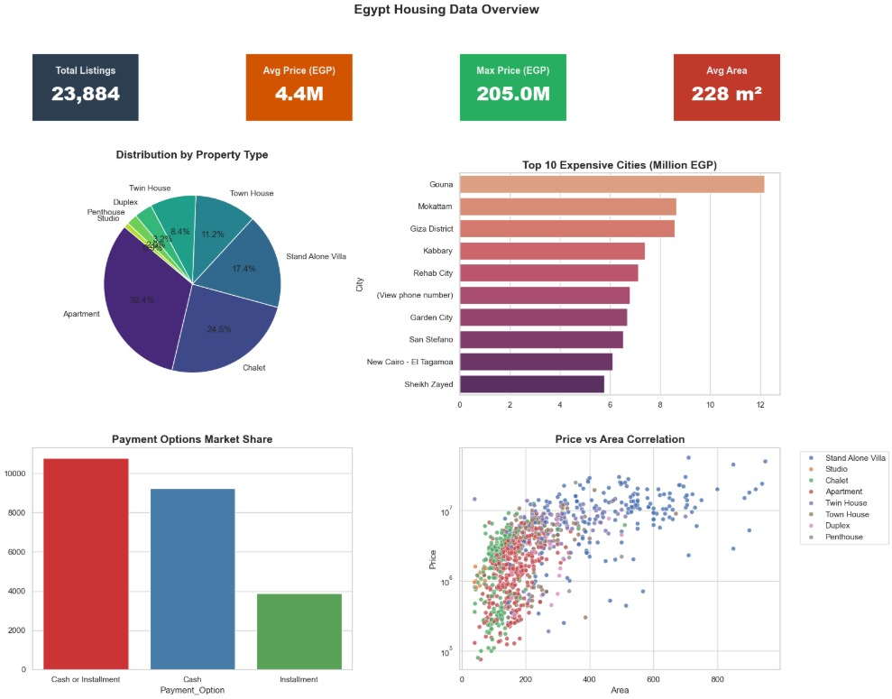
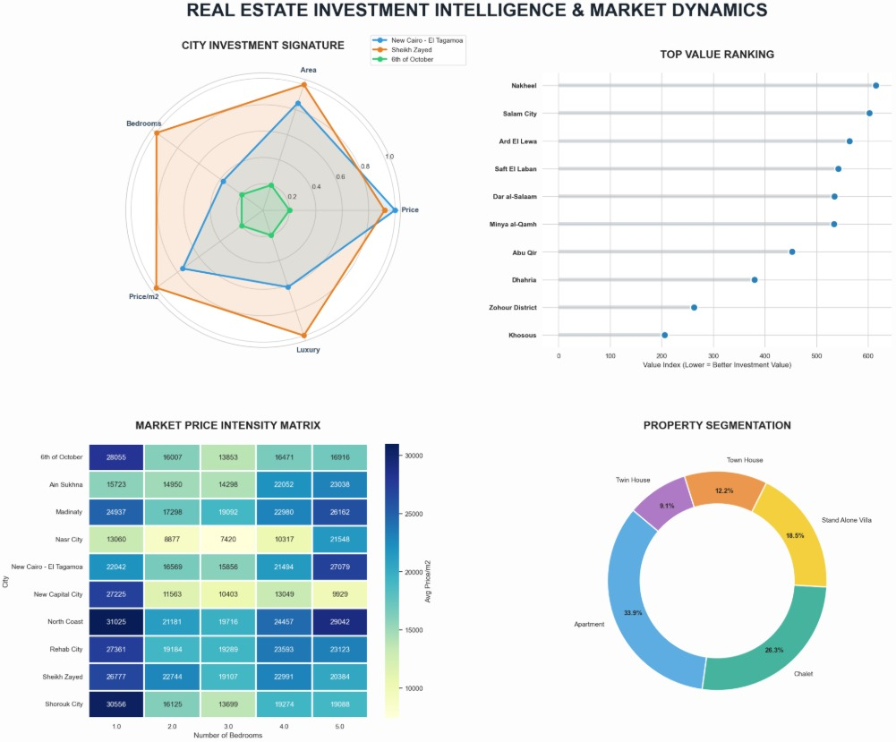
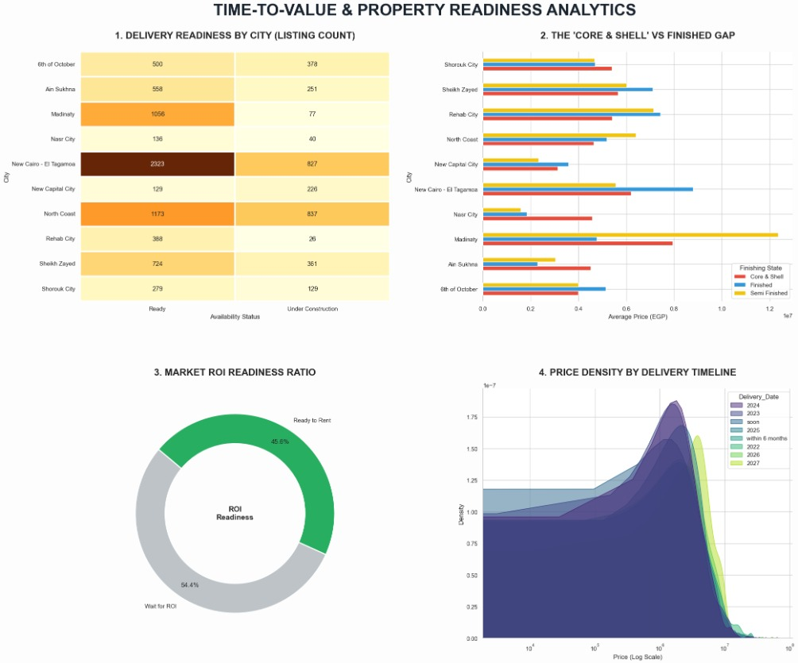
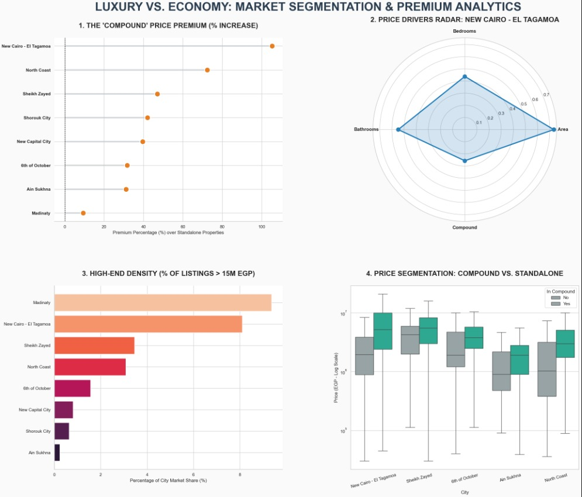

# Egypt Real Estate Market Analysis

This project analyzes real estate prices in Egypt using Python.

## Overview
The project explores how property features such as location, area, type, and amenities affect real estate prices through multiple dashboards.

## Tools Used
- Python  
- Pandas  
- NumPy  
- Matplotlib  
- Seaborn  

## Skills Applied
- Data Cleaning & Preprocessing  
- Exploratory Data Analysis (EDA)  
- Data Visualization & Dashboard Design  
- Feature Engineering (Price per m², Investment Index)  
- Statistical Analysis  
- Insight Extraction & Storytelling  

## Dashboards

### Data Overview

### REAL ESTATE INTELLIGENCE

### PROPERTY READINESS ANALYTICS

### MARKET SEGMENTATION & PREMIUM ANALYTICS

